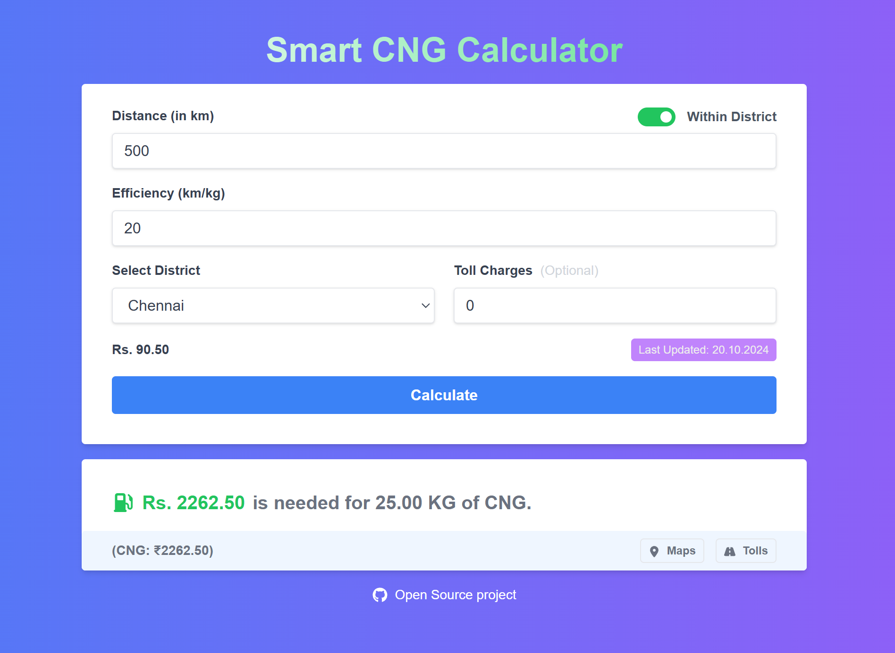

# Smart CNG Calculator

Modern App to estimate travel fuel cost using live CNG rates, district/provider lookup, toll add-ons, and utility tools like **When to Gas** and **RTO Search**.

> ### Project Live: https://smart-cng.vercel.app

## Screenshots



## Core Features

### Smart CNG Calculator (`/`)

- Distance + efficiency based trip cost calculation
- Toll charge support (optional)
- Two modes:
  - Manual fuel cost input
  - District-based fuel cost fetch from provider APIs
- Live provider rate lookup for:
  - Torrent Gas
  - AG&P (Think Gas)
  - Megha Gas
- Provider fetch fallback handling:
  - If provider value is missing/invalid, app falls back to average cost (`93`)
  - User sees a clear fallback notice in UI

### When to Gas (`/when-to-gas`)

- Interactive CNG point/range estimator
- Bunk selection with "next optimal bunk" guidance
- Distance/status visualization (Optimal Range / Too Far / Too Close)
- One-click map navigation for bunks

### RTO Search (`/rto-search`)

- Modern searchable RTO directory UI
- Search by code, city, area, office text (e.g. `TN12`, `KA-41`, city names)
- State filter + **All States** aggregation mode
- Supported datasets currently included:
  - Tamil Nadu
  - Karnataka
  - Kerala
  - Telangana
  - Andhra Pradesh

## API Routes

### `GET /api/districts`

- Reads district/provider mapping from `public/data/districts.json`
- Returns district data used by calculator dropdown

### `GET /api/cng-cost?provider=<encoded-json>`

- Accepts an encoded district object containing provider + station ID
- Fetches and parses live provider data
- Provider-specific parsing includes:
  - Rate extraction
  - Last updated date (when available)

## Tech Stack

- Next.js (App Router)
- React + TypeScript
- Tailwind CSS
- Axios + Cheerio (provider page scraping/parsing)

## Setup & Run

### Prerequisites

- Node.js 18+ (recommended)
- npm / pnpm / yarn / bun

### Install

```bash
npm install
```

### Development

```bash
npm run dev
```

Open: [http://localhost:3000](http://localhost:3000)

### Production Build

```bash
npm run build
npm run start
```

### Lint

```bash
npm run lint
```

## Notes

- Provider integrations rely on external website structure and may require parser/header updates if providers change markup.
- SSL verification is currently bypassed in provider requests (`rejectUnauthorized: false`) for compatibility; harden this before production if possible.

## License

This project is licensed under the MIT License. See [LICENSE](LICENSE).

## Author

**Anbuselvan Annamalai**

- [Facebook](https://facebook.com/anburocky3)
- [LinkedIn](https://linkedin.com/in/anburocky3)
